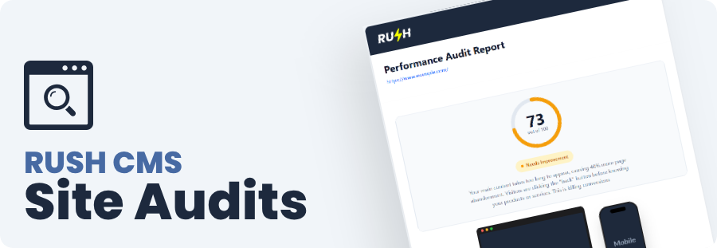

<div align="center">
  

  # Rush CMS Audits Microservice

  [](https://laravel.com)
  [](https://phpstan.org)
  [](https://pestphp.com)
  [](LICENSE)

  **[rushcms.com/site-audits](https://rushcms.com/site-audits)**
</div>

<br>

A standalone, headless microservice dedicated to generating high-fidelity performance reports (Lighthouse/PageSpeed) in PDF format. Designed to be **whitelabel**, **asynchronous**, and **webhook-oriented**.

Ideally used with **n8n** or other automation tools to ingest PageSpeed API data and return professional client-ready PDFs.

> **Documentation:** [docs/](docs/README.md)

## Features

* **Headless Architecture:** API-first design with no frontend UI
* **Whitelabel Ready:** Customize logos, brand names, CTA links, and more via config
* **Asynchronous Processing:** Heavy PDF generation happens in the background via Queues
* **Webhook Callbacks:** Receive a ping with the PDF URL as soon as it's ready
* **Audit Persistence:** All audits stored in database with status tracking (pending, processing, completed, failed)
* **Idempotency Support:** Prevents duplicate audits within configurable time windows
* **Smart Pruning:** Auto-cleanup of old PDF files to save storage
* **Token Authentication:** Built-in console commands to manage API clients
* **Multi-language Support:** English, Portuguese (BR), and Spanish
* **Screenshot Capture:** Automatic desktop & mobile screenshots with device mockup frames
* **SEO & Accessibility Audits:** Optional sections with detailed issue reports
* **Core Web Vitals:** LCP, FCP, CLS with contextual performance messages

## Tech Stack

* **Core:** Laravel 12 API (Slim setup)
* **PDF Engine:** Spatie Browsershot (Puppeteer/Chromium)
* **Image Processing:** Spatie Image (WebP conversion)
* **Queue:** Redis (Recommended)
* **Storage:** Local Public Disk / S3

## Workflow

1. **Ingestion:** Send a URL to `POST /api/v1/scan`
2. **Idempotency Check:** Returns existing audit if duplicate within time window
3. **Database Persistence:** Creates audit record with status `pending`
4. **PageSpeed Fetch:** Fetches Performance, SEO & Accessibility data, marks audit as `processing`
5. **Screenshot Capture:** Takes desktop (1920x1080) and mobile (375x812) screenshots
6. **Image Optimization:** Converts screenshots to WebP (600px width)
7. **PDF Generation:** Renders Blade views with Tailwind CSS, converts to PDF
8. **Status Update:** Marks audit as `completed` with score, metrics, and PDF path
9. **Callback:** Sends POST request to your webhook URL with the PDF link and metadata

## Environment Configuration

```bash
cp .env.example .env
```

Edit the `.env` file to configure:

```ini
APP_URL=https://audits.rushcms.com
APP_TIMEZONE="America/Sao_Paulo"

# Service Logic
AUDITS_WEBHOOK_RETURN_URL="https://your-main-app.com/api/webhook/audit-ready"
AUDITS_CONCURRENCY=1
AUDITS_RETENTION_DAYS=7
AUDITS_IDEMPOTENCY_WINDOW=60

# Branding (Whitelabel)
AUDITS_BRAND_NAME="Rush CMS"
AUDITS_LOGO_PATH="rush-cms-logo.png"

# Report Settings
AUDITS_DATE_FORMAT="d/m/Y H:i"
AUDITS_SHOW_SEO=false
AUDITS_SHOW_ACCESSIBILITY=false
AUDITS_CTA_URL="https://wa.me/5511999999999"

# PageSpeed Insights API (optional, increases rate limits)
PAGESPEED_API_KEY=

# Browsershot / Puppeteer (Critical for Linux/Docker)
BROWSERSHOT_NODE_BINARY="/usr/bin/node"
BROWSERSHOT_NPM_BINARY="/usr/bin/npm"
BROWSERSHOT_CHROME_PATH="/usr/bin/google-chrome"
```

## Configuration Reference

| Variable | Default | Description |
|----------|---------|-------------|
| `APP_TIMEZONE` | `America/Sao_Paulo` | Timezone for date display |
| `AUDITS_BRAND_NAME` | `Rush CMS` | Brand name in header/footer |
| `AUDITS_LOGO_PATH` | `null` | Path to logo in public folder |
| `AUDITS_DATE_FORMAT` | `d/m/Y H:i` | PHP date format for header |
| `AUDITS_SHOW_SEO` | `false` | Show SEO audit section |
| `AUDITS_SHOW_ACCESSIBILITY` | `false` | Show Accessibility section |
| `AUDITS_CTA_URL` | WhatsApp link | Call-to-action button URL |
| `AUDITS_RETENTION_DAYS` | `7` | Days to keep PDF files before pruning |
| `AUDITS_IDEMPOTENCY_WINDOW` | `60` | Minutes to prevent duplicate audits |
| `AUDITS_WEBHOOK_TIMEOUT` | `30` | Webhook timeout in seconds |
| `PAGESPEED_API_KEY` | `null` | Google PageSpeed API key |

## API Reference

### Authentication

All requests require a Bearer Token:
```
Authorization: Bearer <your-token>
```

### Submit Scan

**Endpoint:** `POST /api/v1/scan`

**Request:**
```json
{
  "url": "https://example.com",
  "lang": "pt_BR",
  "strategy": "mobile"
}
```

| Field | Type | Default | Description |
|-------|------|---------|-------------|
| `url` | string | required | URL to analyze |
| `lang` | string | `en` | Language: `en`, `pt_BR`, `es` |
| `strategy` | string | `mobile` | Strategy: `mobile` or `desktop` |

**Response:** `202 Accepted`
```json
{
  "message": "Audit queued",
  "audit_id": "550e8400-e29b-41d4-a716-446655440000",
  "url": "https://example.com",
  "lang": "pt_BR",
  "strategy": "mobile",
  "status": "pending"
}
```

**Note:** Duplicate requests within the idempotency window return the same `audit_id` without triggering new processing.

### Get Audit Status

**Endpoint:** `GET /api/v1/audits/{id}`

**Response:** `200 OK`
```json
{
  "id": "550e8400-e29b-41d4-a716-446655440000",
  "url": "https://example.com",
  "strategy": "mobile",
  "lang": "pt_BR",
  "status": "completed",
  "score": 95,
  "metrics": {
    "lcp": "1.2 s",
    "fcp": "0.8 s",
    "cls": "0.05"
  },
  "pdf_url": "https://audits.rushcms.com/storage/reports/550e8400.pdf",
  "error_message": null,
  "created_at": "2025-12-29T04:00:00Z",
  "completed_at": "2025-12-29T04:02:15Z"
}
```

Status values: `pending`, `processing`, `completed`, `failed`

### Get Stats

**Endpoint:** `GET /api/v1/stats`

**Response:** `200 OK`
```json
{
  "minute": 3,
  "hour": 45,
  "day": 127,
  "month": 1542
}
```

> **Full API Documentation:** [docs/api.md](docs/api.md)

## Console Commands

```bash
# Create API token
php artisan audit:create-token "Client Name"

# Test PDF generation (no API calls)
php artisan test:pdf --lang=pt_BR

# Prune old PDFs
php artisan audit:prune-pdfs

# Check browser setup
php artisan audit:check-browser
```

## Deployment

### System Requirements

- PHP 8.4+
- Node.js 18+
- Chromium/Chrome
- Redis (for queues)

### Queue Worker (Required)

```bash
php artisan queue:work --tries=2 --timeout=180
```

### Scheduler

```bash
php artisan schedule:run
```

## Report Components

The PDF report includes:

1. **Header:** Brand logo + generation timestamp
2. **Performance Score:** Circular gauge with pass/fail indicator
3. **Device Mockup:** iPhone 16 + MacBook frames with live screenshots
4. **Core Web Vitals:** LCP, FCP, CLS cards with progress bars
5. **Performance Messages:** Contextual feedback based on metrics
6. **SEO Section:** Score + failed audit list (optional)
7. **Accessibility Section:** Score + failed audit list (optional)
8. **Closing CTA:** Dynamic message based on score + WhatsApp button
9. **Footer:** Brand name, Audit ID, data source

## License

This project is open-sourced software licensed under the **[GNU Affero General Public License v3.0 (AGPLv3)](LICENSE)**.